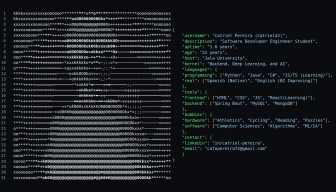

  

Estudiante de Ingeniería de Software Comercial en Jala University, apasionado por el desarrollo de software, la inteligencia artificial y el aprendizaje continuo. 🌎

Desarrollando soluciones innovadoras, compartiendo conocimientos y resolviendo problemas reales con código.

  
  
  

## **Sobre mí**:

Soy estudiante de Ingeniería de Software Comercial en Jala University, con una fuerte inclinación hacia el desarrollo de software, tanto frontend como backend. Me motiva crear herramientas que realmente impacten en la vida de las personas.

Además de mi enfoque técnico, tengo experiencia colaborando en proyectos académicos multiculturales con estudiantes de Colombia, Argentina y Bolivia. También he sido mentor en materias como Cálculo I, Cálculo II, Matemáticas Discretas y Lógica con enfoque en desarrollo de software.

Me gusta trabajar con metodologías ágiles, compartir lo que aprendo y desarrollar proyectos que integren conocimientos de distintas áreas como el desarrollo de software comercial, la educación y la inteligencia artificial.

<table align="right">
<tr><td><a href="./README_es.md">Español</a></td></tr>
<tr><td><a href="./README.md">Inglés</a></td></tr>
</table>

---

### 🛠 &nbsp;Stack Tecnológico

### 🗃 &nbsp;Otros

<h3> Contacta conmigo!:</h3>

---

  

<table align="center">
<tr>
<td align="center">
  
</td>
<td align="center">
  

 

   
  
</td>
</tr>
</table>

### 🚀 Principal foco actual

- 📌 Dominar Spring Boot
- 💬 Trabajando en un chat en tiempo real con Express.js
- ⚛️ Aprendiendo Angular
- 🧠 Explorando IA, redes neuronales y ciencia de datos
- 🔒 Aprendiendo sobre JWT y seguridad
- 🧪 Profundizando en testing y diseño de APIs REST

---

  

### 🤝 Hablemos

📬 Estoy abierto a colaborar y compartir ideas:

- ¿Tienes una idea para desarrollar?
- ¿Quieres aprender o enseñar programación?
- ¿Tienes dudas técnicas o necesitas feedback?
